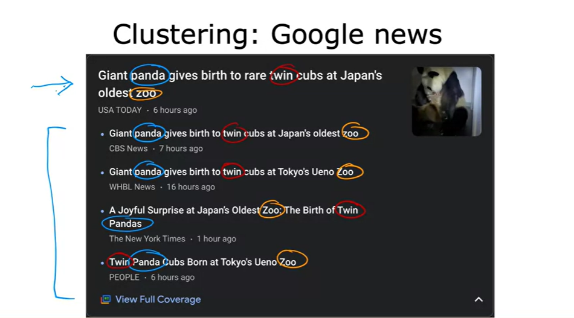

# **Machine Learning:**
Machine learning is about creating systems that can automatically learn and improve from experience, providing the capability to adapt and perform tasks without being explicitly programmed for each specific task.

Subfields of Machine learning:
- Supervised learning 
- Unsupervosed learning
- Reinforcement learning
- Generative AI
  
# Supervised learning:
  Supervised learning is when we give our learning algorithm the right answer  for each example to learn from.
  
  - Regression
  - Classification

  Input -> output [label]
  
  Examples:
  |Input          | Output [labels]      |  Applications|
  | -------           |    -----------           | ---------------  |
  |English            |  Spanish                 |  Machine translation|
  |Email              |  Spam? [ 0 or 1]          |  Spamming filter|
  |Audio              |  Text                    |  Speech recognition| 
  |Ads,user info      |  Click? [0 or 1]          |  Online Aadvertisements or surveys|
  |Image [phone]      |  Defect? [0 or 1]          |  [Visual inspection [**Visual inspection** examines objects or systems for defects, damages, and other issues.] ](https://facilio.com/blog/visual-inspection/) |

Both **Regression and Classification algorithms** are used to predict in Machine learning and work with labeled datasets.

[**Regression:**](https://developers.google.com/machine-learning/glossary#regression-model)
  Regression algorithms help predict continuous numeric variables.
  
  For example, a weather model that predicts the amount of rain, in inches or millimeters, is a regression model.
  
[**Classification:**](https://developers.google.com/machine-learning/glossary#classification-model)
Classification models predict the likelihood that something belongs to a category. Unlike regression models, whose output is a number, classification models output a value that states whether or not something belongs to a particular category. 

For example, classification models are used to predict if an email is spam or if a photo contains a cat.

|Regression          |  Classification|
| -------           | ---------------  |
| |     |  

# Unsupervised learing:
  Find interesting data patterns in your unlabeled data.
  
   [*Clustering*](https://developers.google.com/machine-learning/glossary#clustering) is grouping of similar data points together. Clustering is basically a collection of objects on the basis of similarity and dissimilarity between them. 
   Many clustering algorithms exist. For example, the [k-means](https://developers.google.com/machine-learning/glossary#k-means) algorithm clusters examples based on their proximity to a [centroid](https://developers.google.com/machine-learning/glossary#centroid-based-clustering)
   
   For example: 

  | DNA microarray |  Google News | tech ppl grouping |
  | --------       | ------------ | -------------- |
  | |   |  |
  
   [*Anamoly Detction*](https://www.techtarget.com/searchenterpriseai/definition/anomaly-detection) Anomaly detection is the process of identifying data points, entities or events that fall outside the normal range. It msotly consist to usual data points.
   
   [*Dimensionality Reduction*](https://machinelearningmastery.com/dimensionality-reduction-for-machine-learning/) Dimensionality Reduction compress data using few numbers. Dimensionality reduction refers to techniques that reduce the number of input variables in a dataset.
   
# Reinforcement learning:
In reinforcement learning, an agent takes actions within an environment, and based on those actions, it receives feedback in the form of [rewards](https://developers.google.com/machine-learning/glossary#reward) or penalties. The goal of the agent is to learn a strategy or policy that maximizes the cumulative reward over time.

[**Key components of reinforcement learning:**](https://www.javatpoint.com/reinforcement-learning#Terms)

- **Agent:** The entity that makes decisions and takes actions within the environment.

- **Environment:** The external system with which the agent interacts. It provides feedback to the agent based on the actions taken.

- **State:** The current situation or configuration of the environment that the agent perceives.

- **Action:** The set of possible moves or decisions that the agent can make.

- **Reward:** A numerical value that indicates the immediate feedback the agent receives after taking an action in a particular state. The goal of the agent is to maximize the cumulative reward over time.

# Generative AI:

An emerging transformative field with no formal definition. That said, most experts agree that [generative AI](https://developers.google.com/machine-learning/glossary#generative-ai) models can create ("generate") content that is all of the following:

- Complex
- Coherent
- Original

For example, the following is a partial list of some inputs and outputs for generative models:

- Text-to-text
- Text-to-image
- Text-to-video
- Text-to-code
- Text-to-speech
- Image and text-to-image
