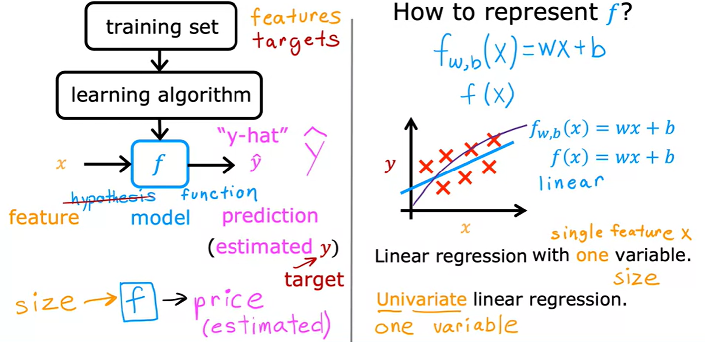
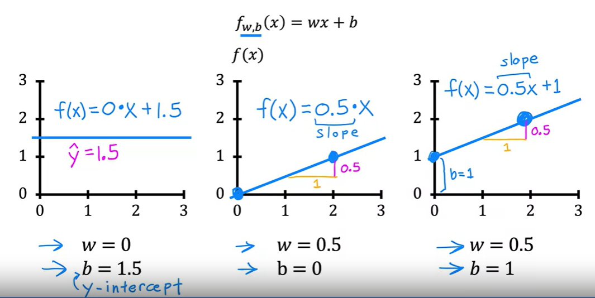
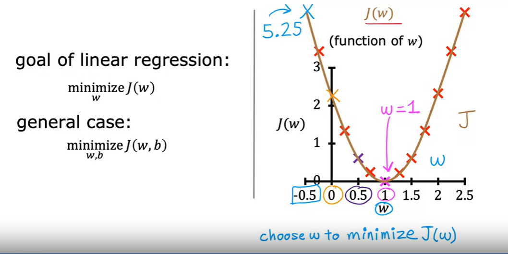
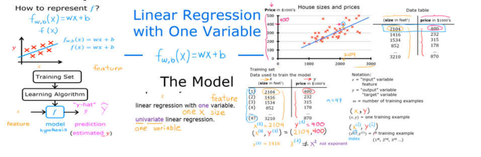

# Linear Regression:

Linear regression is a fundamental and widely used technique in machine learning for modeling the relationship between a dependent variable and one or more independent variables by fitting a linear equation to the observed data. It is particularly well-suited for tasks where the relationship between the variables is assumed to be linear.

Linear regression also called univariate linear regression.

**Formula:**


&nbsp;&nbsp;&nbsp;&nbsp;&nbsp;&nbsp;&nbsp;&nbsp;   $f_{w,b}(x) = wx + b$     &nbsp;&nbsp;&nbsp;&nbsp;&nbsp;&nbsp;&nbsp;&nbsp;    and                      &nbsp;&nbsp;&nbsp;&nbsp;&nbsp;&nbsp;&nbsp;&nbsp;    $y = f_{w,b}(x)$
 

it also can be write as 

&nbsp;&nbsp;&nbsp;&nbsp;&nbsp;&nbsp;&nbsp;&nbsp;    $f(x)  = wx + b $

- All values of $x$ treated as `features`.
- All values of $y$ treated as `targets`.



where

- $y$ is the dependent variable.

- $x$ is the independent variable.

- $b$ is the y-intercept.

- $w$ is the slope.

Here are some Examples of Linear Regression:



and we can say,

&nbsp;&nbsp;&nbsp;&nbsp;&nbsp;&nbsp;&nbsp;&nbsp;   $f_{w,b}(x^{(i)}) = wx^{(i)} + b$ &nbsp;&nbsp;&nbsp;&nbsp;&nbsp;&nbsp;&nbsp;&nbsp;   and                       &nbsp;&nbsp;&nbsp;&nbsp;&nbsp;&nbsp;&nbsp;&nbsp;   ${y}^{(i)} = f_{w,b}(x^{(i)})$

**Remember:**

```here `i` is not exponent, `i` is the index of that value```.
if `i` = 5, it's mean value of `x` or `y` at `5th` index.

# Goal of Linear Regression:

The goal of linear regression is to find the values of $w$ and $b$ that minimize the sum of squared differences between the observed values of the dependent variable and the values predicted by the linear model.In other words, linear regression aims to find the best-fitting linear relationship between the input variables and the output variable.
- to choose the value of $w$ that approximately equal or close to function actual values.



# Summary
here a quick summary to linear regression:




