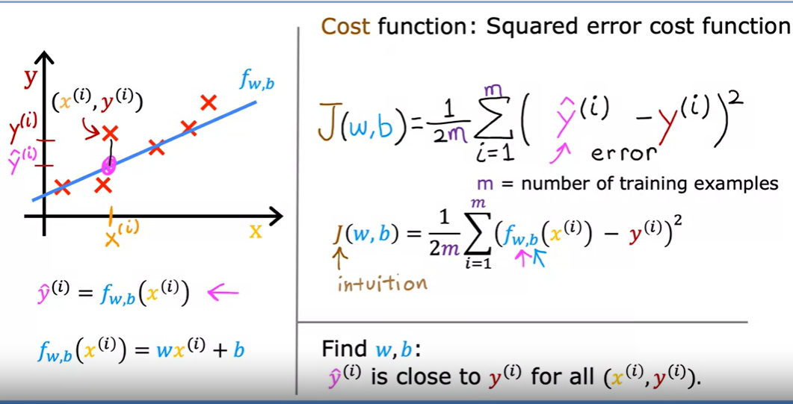
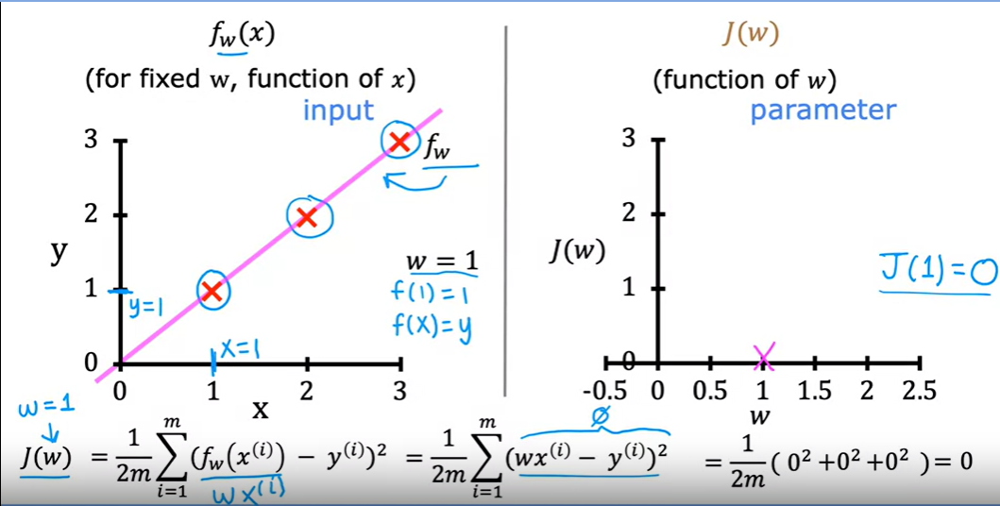
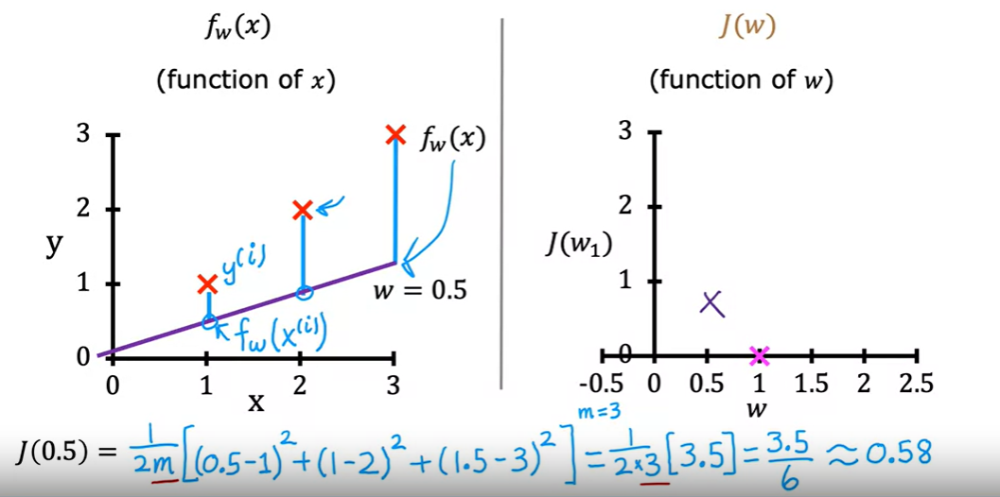
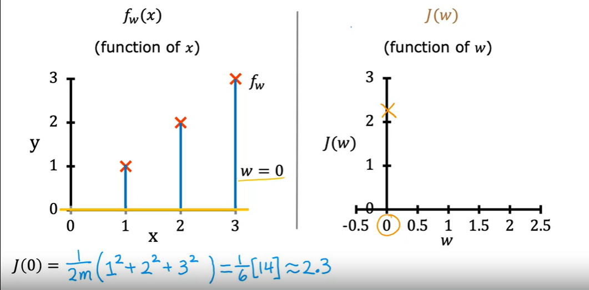

# Cost Function [Loss function]:
The terms cost function & loss function are analogous.

```Cost function:``` Used to refer to an average of the loss functions over an entire training dataset.

```Loss function:``` Used when we refer to the error for a single training example.


The equation for cost with one variable is:
  $$J(w,b) = \frac{1}{2m} \sum\limits_{i = 0}^{m-1} (f_{w,b}(x^{(i)}) - y^{(i)})^2 \tag{1}$$ 
 
where 
  $$f_{w,b}(x^{(i)}) = wx^{(i)} + b \tag{2}$$
  
- $f_{w,b}(x^{(i)})$ is our prediction for example $i$ using parameters $w,b$.  
- $(f_{w,b}(x^{(i)}) -y^{(i)})^2$ is the squared difference between the target value and the prediction.   
- These differences are summed over all the $m$ examples and divided by `2m` to produce the cost, $J(w,b)$.  
>Note, In theatrically summation ranges are typically from 1 to m, while code will be from 0 to m-1.



There are many cost functions in machine learning and each has its use cases depending on whether it is a regression problem or classification problem.
- Regression cost Function
- Binary Classification cost Functions
- Multi-class Classification cost Functions

here we have some examples for Regression cost Function.







[**What is total and average cost function?**](https://www.analyticsvidhya.com/blog/2021/02/cost-function-is-no-rocket-science/)

The total cost function calculates the total cost of production for a given quantity of output, including fixed and variable costs. It is represented as TC(Q) = FC + VC(Q). The average cost function calculates the cost per unit of output, and is represented as AC(Q) = TC(Q) / Q. Average cost is the total cost divided by the quantity of output, and is used to determine the optimal level of production that minimizes costs.
