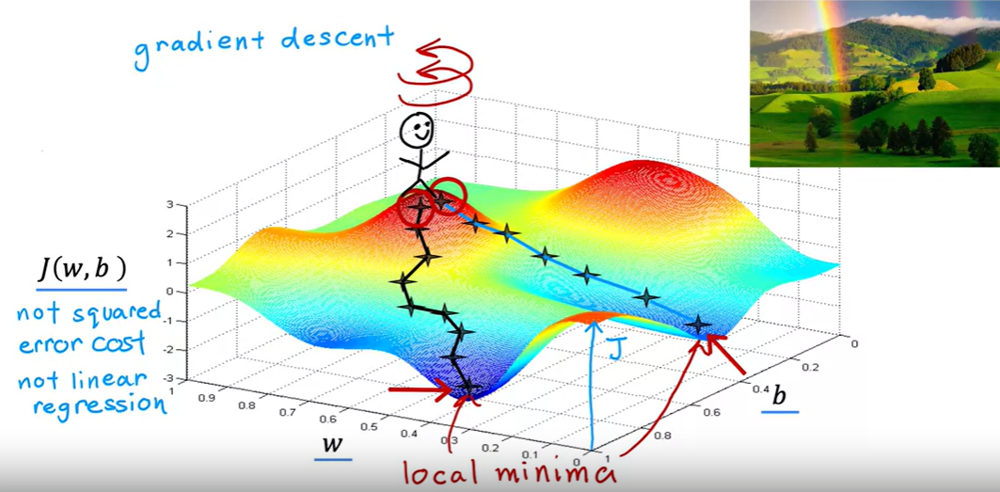
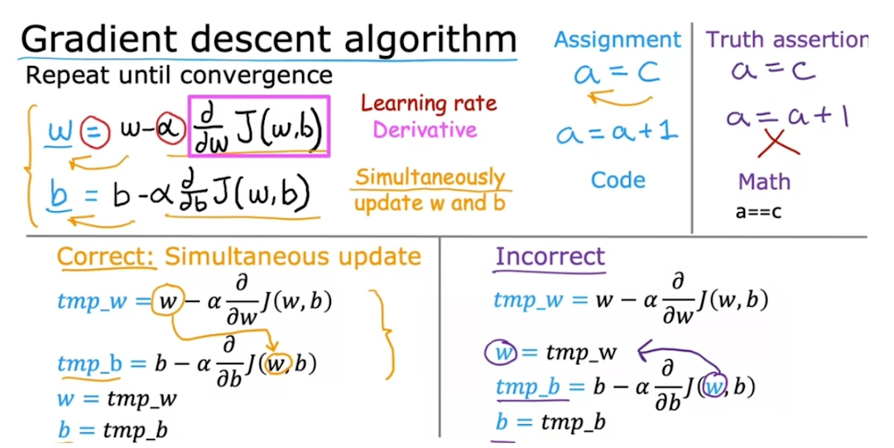
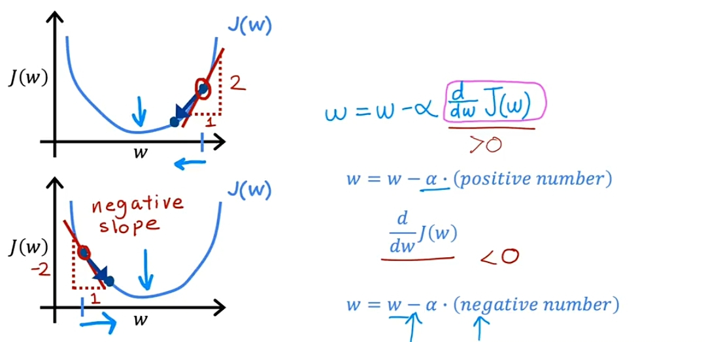
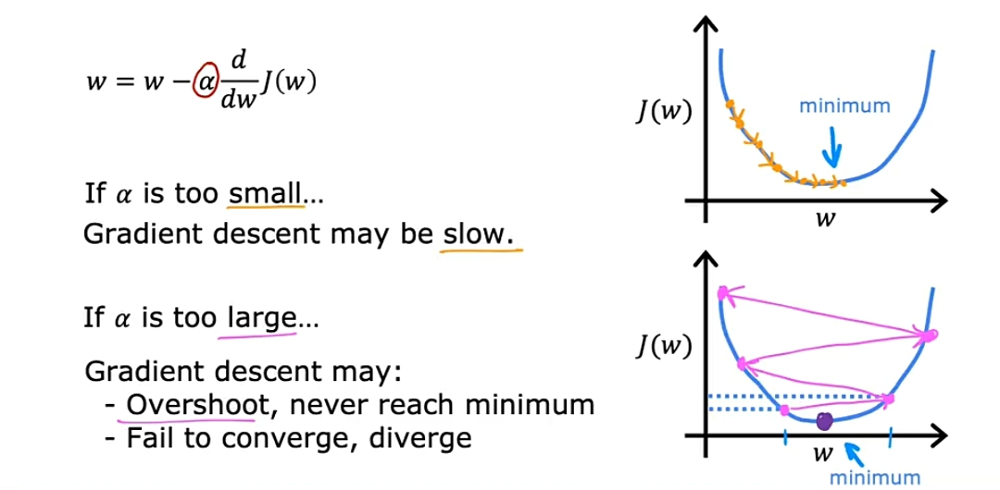
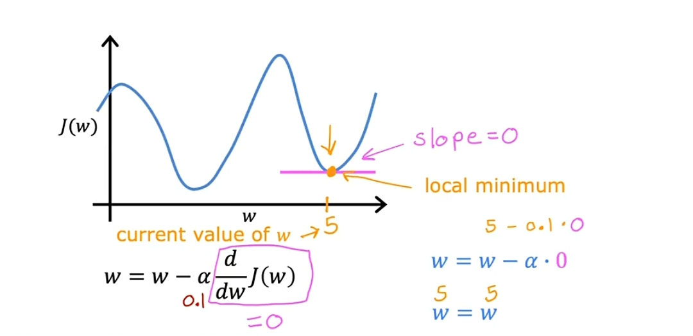
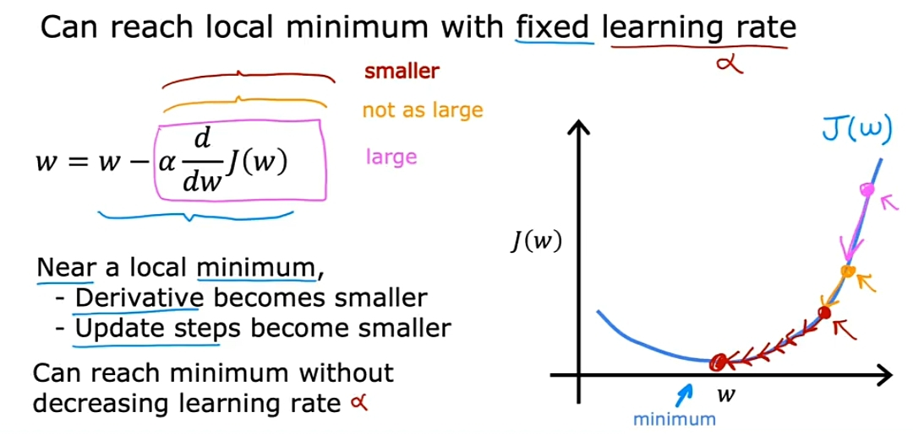

## Gradient Descent: 
It is a first-order iterative algorithm for finding a local minimum of a differentiable multivariate function.
The idea is to take repeated steps in the opposite direction of the gradient (or approximate gradient) of the function at the current point, because this is the direction of steepest descent.

*Gradient descent* was described as:

$$\begin{align*} \text{repeat}&\text{ until convergence:}  
\newline \lbrace \newline
 w &= w -  \alpha \frac{\partial }{\partial w}J(w,b) \; \newline 
 b &= b -  \alpha \frac{\partial }{\partial b}J(w,b) \newline \rbrace
\end{align*}$$
where, parameters $w$, $b$ are updated simultaneously.  
The gradient is defined as:
$$
\begin{align}
\frac{\partial J(w,b)}{\partial w}  &= \frac{1}{m} \sum\limits_{i = 0}^{m-1} (f_{w,b}(x^{(i)}) - y^{(i)})x^{(i)} \tag{4}\\
  \frac{\partial J(w,b)}{\partial b}  &= \frac{1}{m} \sum\limits_{i = 0}^{m-1} (f_{w,b}(x^{(i)}) - y^{(i)}) \tag{5}\\
\end{align}
$$

Here *simultaniously* means that you calculate the partial derivatives for all the parameters before updating any of the parameters.

Here is a quick revision about correct | incorrect updation of values $w$ and $b$:

# GradientDescent-intuition:

- The learning rate α is always a positive number, so if you take $w$ minus a positive number, you end up with a new value for $w$ that is smaller.
- The learning rate α is always a negative number, so if you take $w$ minus a negative number, you end up with a new value for $w$ that is greater.

# Learning Rate $a$:
here's the graph of the function $J$ of $w$.
- What happens if the learning rate is too small?

  Then what happens is that we multiply derivative term by some really, really small number. So it'll going to be multiplying by number alpha. 
That's really small, like 0.0000001. And so end up taking a very small baby step like that. Then from this point we take another tiny tiny little baby step
The outcome of this process is that end up decreasing the cost $J$ but incredibly slowly. 
So, here's another step and another step, another tiny step until you finally approach the minimum. 
But as you may notice you're going to need a lot of steps to get to the minimum.
It will take a very long time because it's going to take these tiny tiny baby steps. 
And it's going to need a lot of steps before it gets anywhere close to the minimum. 
The learning rate $a$ is the small or smallest step of any function.

`So to summarize if the learning rate is too small, then gradient descents will work, but it will be slow.`
 

- What happens if the learning rate is too large?

  Let's say it's actually already pretty close to the minimum. So the decorative points to the right.
But if the learning rate is too large then $w$ will update very giant step to be all the way over here.
And that's this point here on the function J. So move from this point on the left, all the way to the next point on the right.
And now the cost has actually gotten worse.
And another way to say that is that great intersect may fail to converge and may even diverge.
It has increased because it started out at this value here and after one step,
it actually increased to this value here. Now the derivative at this new point says to decrease W but when the learning rate is too big.
Then it may take a huge step going from here all the way out here.

`So if the learning rate is too large, then creating the sense may overshoot and may never reach the minimum.`

- What happens if the learning rate is reached to local minimum?

  let's draw attention to the function at this point where learning rate is reached to local minimum.
  The slope of this line is zero and thus the derivative term.
  Here is equal to zero for the current value of $w$.
  And so grading descent is update becomes $w$ is updated to $w$ minus the learning rate times zero.
  because the derivative term is equal to zero. And this is the same as saying let's set $w$ to be equal to $w$.
  So this means that if function is already at a local minimum, gradient descent leaves $w$ unchanged.

Normally it is `0.01`.

