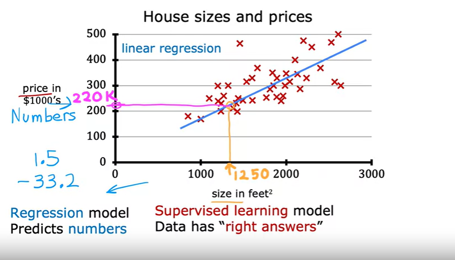

# **Machine Learning:**
- Supervised learning 
- Unsupervosed learning
- Reinforcement learning
  
# Supervised learing:
  Supervised learning is when we give our learning algorithm the right answer  for each example to learn from.
    
  Input -> output [lables]
  
  Examples:
  |Input          | Output [lable]      |  Applications|
  | -------           |    -----------           | ---------------  |
  |English            |  Spanish                 |  Machine translation|
  |Email              |  Spam? [ 0 or 1]          |  Spamming filter|
  |Audio              |  Text                    |  Speech recognition| 
  |Ads,user info      |  Click? [0 or 1]          |  Online Aadvertisements or surveys|
  |Image [phone]      |  Defect? [0 or 1]          |  [Visual inspection [**Visual inspection** examines objects or systems for defects, damages, and other issues.] ](https://facilio.com/blog/visual-inspection/) |

Both **Regression and Classification algorithms** are used to predict in Machine learning and work with labeled datasets.

[**Regression:**](https://www.simplilearn.com/regression-vs-classification-in-machine-learning-article#regression_in_machine_learning_explained)
  Regression algorithms help predict continuous variables.
  
[**Classification:**](https://www.simplilearn.com/regression-vs-classification-in-machine-learning-article#classification_in_machine_learning_explained)
Classification is an algorithm that finds functions that help divide the dataset into classes based on various parameters.

|Regression          |  Classification|
| -------           | ---------------  |
|              |              |

# Unsupervised learing:
  Find interesting data patterns in your unlabeled data.
  
   [*Clustering*](https://www.geeksforgeeks.org/clustering-in-machine-learning/) is grouping of similar data points together. Clustering is basically a collection of objects on the basis of similarity and dissimilarity between them. 
   For example: 

  | DNA microarray |  Google News | tech ppl grouping |
  | --------       | ------------ | -------------- |
  | |   |  |
  
   [*Anamoly Detction*](https://www.techtarget.com/searchenterpriseai/definition/anomaly-detection) Anomaly detection is the process of identifying data points, entities or events that fall outside the normal range. It msotly consist to usual data points.
   
   [*Dimensionality Reduction*](https://machinelearningmastery.com/dimensionality-reduction-for-machine-learning/) Dimensionality Reduction compress data using few numbers. Dimensionality reduction refers to techniques that reduce the number of input variables in a dataset

  
